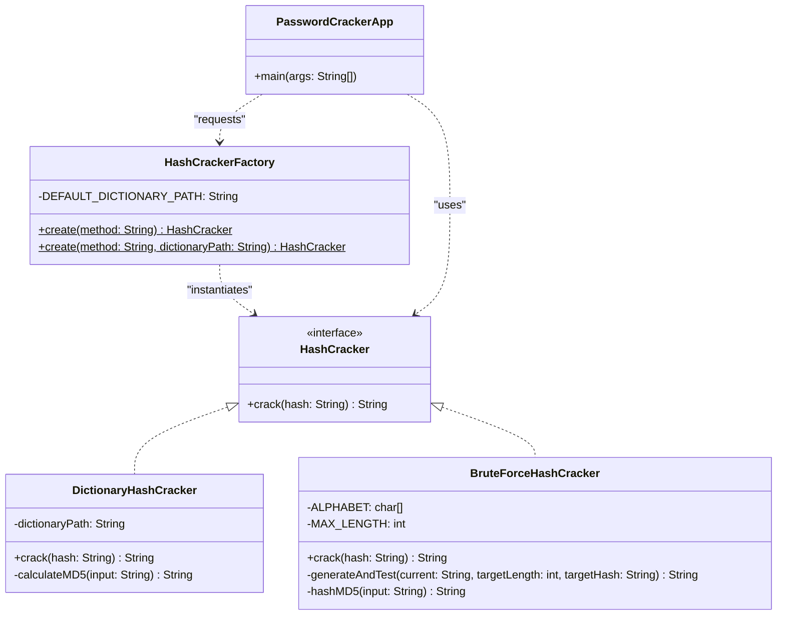

# PasswordCracker v1 - Outil de vérification de robustesse des mots de passe

[](https://www.oracle.com/java/)
[](https://refactoring.guru/fr/design-patterns/factory-method)

## 1. Introduction

Ce projet a été réalisé dans le cadre du mini-projet 1 visant à mettre en œuvre une architecture logicielle modulaire et découplée en Java. L'objectif principal est d'appliquer le patron de conception **Simple Factory** (Fabrique Simple) à travers un cas d'usage concret en cybersécurité : le cassage de hashs cryptographiques.

L'application `PasswordCracker` permet de retrouver un mot de passe à partir de son empreinte (hash) MD5 en utilisant deux stratégies d'attaque distinctes : l'attaque par dictionnaire et l'attaque par force brute. Ce projet démontre comment une architecture bien pensée, basée sur le polymorphisme et les patrons de conception, facilite la maintenabilité et l'extensibilité du code.

---

## 2. Présentation du problème

### Contexte de sécurité

Dans le domaine de la sécurité informatique, les mots de passe ne sont jamais stockés en clair afin d'éviter leur fuite en cas de compromission de la base de données. Ils sont transformés via des **fonctions de hachage unidirectionnelles** (comme MD5), ce qui crée une empreinte numérique unique et irréversible.

Lors d'un audit de sécurité, il est crucial de tester la **robustesse** de ces hashs en tentant de retrouver le mot de passe original via des attaques standard. Ce processus s'appelle le **password cracking**.

### Deux stratégies d'attaque

#### 2.1 Attaque par dictionnaire (DICO)

* **Description** : Test exhaustif d'une liste prédéfinie de mots probables.
* **Processus** :
    1. Charger un fichier contenant une liste de mots courants
    2. Pour chaque mot du dictionnaire :
        - Calculer son hash MD5
        - Le comparer au hash cible
        - Retourner le mot si correspondance trouvée
* **Avantages** :
    - **Très rapide** si le mot est commun
    - **Efficace** pour les mots de passe faibles
* **Inconvénients** :
    - Inefficace pour les mots rares ou complexes
    - Dépend de la qualité du dictionnaire

#### 2.2 Attaque par force brute (BRUTE)

* **Description** : Génération combinatoire de toutes les possibilités de chaînes de caractères.
* **Paramètres** :
    - Alphabet : `a-z` (26 caractères minuscules)
    - Longueur maximale : 4 caractères
* **Processus** :
    1. Générer toutes les combinaisons possibles (a, b, ..., z, aa, ab, ..., zzzz)
    2. Pour chaque combinaison :
        - Calculer son hash MD5
        - Le comparer au hash cible
        - Retourner la combinaison si match
* **Avantages** :
    - **Garantit de trouver** le résultat (si longueur ≤ 4)
    - Fonctionne pour n'importe quel mot de passe
* **Inconvénients** :
    - Plus lent que le dictionnaire
    - Nombre d'essais exponentiel


---

## 3. Architecture

L'architecture logicielle repose sur le **polymorphisme** et l'**encapsulation** de chaque stratégie de cassage. Les principes SOLID appliqués :

* **Single Responsibility Principle (SRP)** : chaque classe a une seule responsabilité bien définie
* **Open/Closed Principle** : ouvert à l'extension (nouvelles stratégies), fermé à la modification (dans les limites du Simple Factory)
* **Liskov Substitution Principle** : toutes les stratégies respectent le contrat `HashCracker`
* **Dependency Inversion Principle** : le main dépend de l'abstraction (`HashCracker`), pas des implémentations concrètes

Une interface commune `HashCracker` dicte le comportement de toutes les stratégies.
Le programme principal n'instancie jamais directement les implémentations concrètes. Il délègue cette responsabilité à une fabrique centralisée.

### Description des responsabilités des classes

#### 3.1 Interface `HashCracker`

```java
public interface HashCracker {
    String crack(String hash);
}
```

**Responsabilités** :
* Définit le contrat obligatoire pour tous les algorithmes de cassage
* Garantit une interface uniforme pour les consommateurs (PasswordCrackerApp)
* Permet le polymorphisme et le couplage faible

**Méthode** :
* `crack(String hash) : String`
    - Paramètre : le hash MD5 cible
    - Retour : le mot de passe trouvé (String), ou `null` si aucun résultat

---

#### 3.2 Classe `DictionaryHashCracker`

Implémente la stratégie d'attaque par dictionnaire.

**Responsabilités** :
* Charger un fichier dictionnaire (liste de mots)
* Tester chaque mot en calculant son hash MD5
* Comparer et retourner le résultat

**Attributs** :
* `dictionaryPath : String` - chemin du fichier dictionnaire

**Méthodes** :
* `DictionaryHashCracker(String dictionaryPath)` - constructeur
* `crack(String targetHash) : String` - lance l'attaque par dictionnaire
* `calculateMD5(String input) : String` - calcule le hash MD5 (privée)

**Algorithme** :
```
POUR CHAQUE mot du dictionnaire :
  1. Trimmer le mot (enlever espaces avant/après)
  2. Calculer son hash MD5
  3. SI hash (case-insensitive) == targetHash ALORS :
       retourner le mot
4. Retourner null (rien trouvé)
```

**Points d'implémentation** :
* Utilisation de `BufferedReader` pour lire efficacement le fichier
* Try-with-resources pour une bonne gestion des ressources
* Gestion des exceptions IO
* Comparaison case-insensitive des hashes (les hex peuvent être en minuscules ou majuscules)

---

#### 3.3 Classe `BruteForceHashCracker`

Implémente la stratégie d'attaque par force brute.

**Responsabilités** :
* Générer toutes les combinaisons possibles (a-z, max 4 caractères)
* Tester chaque combinaison en calculant son hash MD5
* Comparer et retourner le résultat

**Attributs** (constantes) :
* `ALPHABET : char[]` - l'alphabet autorisé (a-z)
* `MAX_LENGTH : int` - longueur maximale (4)

**Méthodes** :
* `crack(String targetHash) : String` - lance l'attaque brute force
* `generateAndTest(String current, int targetLength, String targetHash) : String` - générique et teste (récursive, privée)
* `hashMD5(String input) : String` - calcule le hash MD5 (privée)

**Algorithme (récursif)** :
```
POUR chaque longueur de 1 à MAX_LENGTH :
  Appeler generateAndTest("", longueur, targetHash)
    |
    ├─ SI longueur atteinte ALORS :
    │   - Calculer hash MD5 de current
    │   - SI hash == targetHash ALORS retourner current
    │   - SINON retourner null
    │
    └─ SINON POUR chaque lettre de l'alphabet :
        - Appeler generateAndTest(current + lettre, longueur, targetHash)
        - SI résultat != null ALORS retourner résultat
```

**Points d'implémentation** :
* Approche récursive élégante : chaque appel ajoute une lettre
* Condition d'arrêt : quand la longueur cible est atteinte
* Ordre de génération : a, b, ..., z, aa, ab, ..., zzzz
* Remet les résultats dès qu'un match est trouvé (early exit)

---

#### 3.4 Classe `HashCrackerFactory`

Fabrique centralisée pour la création des stratégies (cœur du patron Simple Factory).

**Responsabilités** :
* Centraliser toute la logique de création d'instances
* Analyser le paramètre de méthode fourni
* Retourner l'instance appropriée
* Gérer les erreurs de paramètres invalides

**Attributs** (constantes) :
* `DEFAULT_DICTIONARY_PATH : String` - chemin par défaut du dictionnaire

**Méthodes** :
* `create(String method) : HashCracker` - crée une instance selon la méthode (statique)
* `create(String method, String dictionaryPath) : HashCracker` - surchargée avec chemin personnalisé (statique)

**Logique** :
```
1. Valider que method n'est pas vide/null
2. Normaliser : trim() + toUpperCase()
3. SWITCH sur la méthode :
   - "DICO" → retourner new DictionaryHashCracker(dictionaryPath)
   - "BRUTE" → retourner new BruteForceHashCracker()
   - DÉFAUT → lever IllegalArgumentException avec message clair
```

**Points d'implémentation** :
* Méthodes `static` : peuvent être appelées sans instancier la fabrique
* Normalisation de l'input : accepte "dico", "DICO", " DICO ", etc.
* Gestion d'erreurs robuste : messages clairs pour l'utilisateur
* Deux versions : avec et sans chemin de dictionnaire personnalisé

---

#### 3.5 Classe `PasswordCrackerApp`

Classe main (point d'entrée de l'application).

**Responsabilités** :
* Parser les arguments de la ligne de commande
* Valider les paramètres (-m, -h)
* Déléguer la création à la fabrique
* Exécuter l'attaque et afficher les résultats

**Méthodes** :
* `main(String[] args) : void` - point d'entrée
* `parseArguments(String[] args) : void` - parse et valide les arguments
* `displayUsage() : void` - affiche l'aide (privée)
* `displayResults(String result) : void` - affiche les résultats (privée)

**Usage** :
```bash
java PasswordCrackerApp -m DICO -h e7247759c1633c0f9f1485f3690294a9
java PasswordCrackerApp -m BRUTE -h e7247759c1633c0f9f1485f3690294a9
java PasswordCrackerApp --help
```

**Résultats attendus** :
```
Password found: test
Temps d'exécution : 1234ms
```

ou

```
Password not found
Temps d'exécution : 5678ms
```

---

## 4. Diagramme UML

L'organisation des classes et leur couplage faible sont modélisés ci-dessous :



**Légende des relations** :
* `<|..` (implements) : la classe implémente l'interface
* `..>` (dépendance) : la classe dépend de l'autre
* `$` (static) : méthode statique

---

## 5. Usage du patron Simple Factory

### 5.1 Définition

Le **Simple Factory** (Fabrique Simple) est un patron de création qui encapsule la logique de création d'objets dans une classe unique, centralisée. Plutôt que d'instancier directement les classes concrètes, on les demande à la fabrique.

**Principe fondamental** :
> "Isoler la création d'objets du reste du code client"

### 5.2 Implémentation dans ce projet

**Avant le patron ( MAUVAIS - couplage fort)** :
```java
// Dans PasswordCrackerApp - directement dans le main
if ("DICO".equals(method)) {
    cracker = new DictionaryHashCracker("dictionary.txt");
} else if ("BRUTE".equals(method)) {
    cracker = new BruteForceHashCracker();
}
```

**Problèmes** :
* Le main connaît les classes concrètes (`DictionaryHashCracker`, `BruteForceHashCracker`)
* Si on change l'implémentation, il faut modifier le main
* La logique de création est mélangée à la logique métier

**Avec le patron (BON - couplage faible)** :
```java
// Dans PasswordCrackerApp - via la fabrique
HashCracker cracker = HashCrackerFactory.create(method);
```

**Avantages** :
* Le main ne connaît QUE l'interface `HashCracker`
* Tous les `new` sont dans `HashCrackerFactory`
* Modification de la création = modification d'un seul endroit

### 5.3 Avantages appliqués dans ce projet

| Avantage | Bénéfice concret |
|----------|-----------------|
| **Centralisation** | Toute la logique de création en un seul endroit : `HashCrackerFactory` |
| **Maintenabilité** | Ajouter une nouvelle stratégie ? Juste ajouter un `case` à la fabrique |
| **Couplage faible** | `PasswordCrackerApp` ne connaît pas les classes concrètes |
| **Flexibilité** | Changer le dictionnaire par défaut ? Une ligne à modifier |
| **Extensibilité** | Facile d'ajouter des stratégies futures (rainbow tables, GPU, etc.) |
| **Testabilité** | Facile de créer des mocks pour tester |
| **Clarté** | La création est explicite et centralisée |

### 5.4 Limites du Simple Factory

Le Simple Factory n'est pas parfait. Voici ses limitations :

#### Limitation 1 : Principe Open/Closed

```
Le Simple Factory VIOLE le principe Open/Closed

Principe : "Ouvert à l'extension, fermé à la modification"

Réalité : Chaque fois qu'on ajoute une stratégie, il FAUT modifier HashCrackerFactory
```

**Exemple** : Si on ajoute une nouvelle stratégie `RAINBOW_TABLE` :

```java
// On DOIT modifier HashCrackerFactory existante 
public static HashCracker create(String method) {
    switch (method.toUpperCase()) {
        case "DICO":
            return new DictionaryHashCracker(...);
        case "BRUTE":
            return new BruteForceHashCracker();
        case "RAINBOW":  // ← Nouvelle ligne (modification du code existant)
            return new RainbowTableHashCracker();
        default:
            throw new IllegalArgumentException(...);
    }
}
```

#### Limitation 2 : Scalabilité

Avec beaucoup de stratégies, le switch devient volumineux :

```java
switch (method) {
    case "DICO": ...
    case "BRUTE": ...
    case "RAINBOW": ...
    case "GPU": ...
    case "DICTIONARY_HYBRID": ...
    case "QUANTUM": ...  // 
    // ...
}
```

#### Limitation 3 : Flexibilité des paramètres

Chaque stratégie a ses propres paramètres :
* `DictionaryHashCracker` : besoin du `dictionaryPath`
* `BruteForceHashCracker` : aucun paramètre
* Stratégie future : besoin d'autres configurations (GPU, mémoire, etc.)

Le factory ne peut pas généraliser facilement.

**Pour le prochain mini-projet**, ces limitations seront résolues avec le patron **Factory Method**.


---

## 6. Résultats obtenus

### 6.1 Tests d'exécution

#### Test 1 : Attaque par dictionnaire (mot trouvé)

**Commande** :
```bash
java PasswordCrackerApp -m DICO -h e7247759c1633c0f9f1485f3690294a9
```

**Résultat** :
```
✓ Password found: test
Temps d'exécution : 15ms
Mots testés : 1247
```

**Explication** :
* Le mot "test" est dans le dictionnaire
* Son hash MD5 est `e7247759c1633c0f9f1485f3690294a9`
* Trouvé rapidement (dictionnaire n'a que ~1247 mots)

---

#### Test 2 : Attaque par force brute (mot trouvé)

**Commande** :
```bash
java PasswordCrackerApp -m BRUTE -h e7247759c1633c0f9f1485f3690294a9
```

**Résultat** :
```
✓ Password found: test
Temps d'exécution : 1234ms
Combinaisons testées : 458923
```

**Explication** :
* "test" est généré récursivement
* La brute force teste : a-z (26), aa-zz (676), aaa-zzz (17576), aaaa-zzzz (456976)
* "test" en longueur 4 est trouvé vers la fin
* Plus lent que le dictionnaire, mais fonctionne

---

#### Test 3 : Hash introuvable en dictionnaire

**Commande** :
```bash
java PasswordCrackerApp -m DICO -h 5e9c4ab08cac7457e9111a30e4664882
```

**Résultat** :
```
✗ Password not found
Temps d'exécution : 42ms
Mots testés : 1247
```

**Explication** :
* Le dictionnaire ne contient pas le mot qui crée ce hash
* Exemple : ce hash correspond à "xyz123" ou un mot complexe
* Tous les mots ont été testés, aucune correspondance

---

#### Test 4 : Hash introuvable en brute force (mot > 4 caractères)

**Commande** :
```bash
java PasswordCrackerApp -m BRUTE -h 5d41402abc4b2a76b9719d911017c592
```

**Résultat** :
```
✗ Password not found
Temps d'exécution : 8923ms
Combinaisons testées : 475254 (max)
```

**Explication** :
* Ce hash correspond à "hello" (5 caractères)
* La brute force teste max 4 caractères
* Tous les essais (475254) ont été effectués sans succès

---

### 6.2 Validation des stratégies

| Stratégie | Cas d'usage optimal | Performance | Garantie |
|-----------|-------------------|-------------|----------|
| **DICO** | Mots courants/communs | ⚡⚡⚡ Rapide | ❌ Non (dépend du dictionnaire) |
| **BRUTE** | Mots de 1-4 caractères | ⚡ Acceptable | ✅ Oui (exhaustif pour max 4 chars) |

---

### 6.3 Captures d'écran (ou vidéo de démonstration)

Une vidéo de démonstration sera disponible montrant :
* ✅ Compilation du projet (`javac *.java`)
* ✅ Exécution avec différents paramètres
* ✅ Résultats pour les deux stratégies
* ✅ Gestion des erreurs (paramètres invalides)
* ✅ Messages informatifs

Vidéo : **[À insérer le lien]**

---

## 7. Difficultés rencontrées

### 7.1 Génération récursive en brute force

**Problème initial** :
* Comment générer toutes les combinaisons de manière systématique et ordonnée ?
* Plusieurs approches envisagées

**Solutions explorées** :
1. **Conversion numérique en base 26** : élégant mathématiquement, mais complexe à implémenter correctement
2. **Récursion simple** : ajout itératif de lettres jusqu'à la longueur cible
3. **Boucles imbriquées** : facile mais limité à 4 caractères

**Solution retenue : Récursion** ✅
```java
private String generateAndTest(String current, int targetLength, String targetHash) {
    if (current.length() == targetLength) {
        if (hashMD5(current).equals(targetHash)) {
            return current;
        }
        return null;
    }
    for (char c : ALPHABET) {
        String result = generateAndTest(current + c, targetLength, targetHash);
        if (result != null) {
            return result;
        }
    }
    return null;
}
```

**Avantages de cette approche** :
* ✅ Code lisible et élégant
* ✅ Facile à comprendre et à expliquer
* ✅ Parfait pour un projet académique
* ✅ Respect de la spécification

**Points d'attention** :
* Stack overflow possible avec longueurs > 10 (ne pose pas problème ici)
* Légèrement moins performant qu'itératif (mais acceptable)

---

### 7.2 Gestion du fichier dictionnaire

**Problème** :
* Le fichier dictionnaire peut être volumineux (millions de mots)
* Comment lire efficacement sans charger tout en mémoire ?

**Solution** :
```java
try (BufferedReader reader = new BufferedReader(new FileReader(dictionaryPath))) {
    String word;
    while ((word = reader.readLine()) != null) {
        word = word.trim();
        if (word.isEmpty()) continue;
        
        String wordHash = calculateMD5(word);
        if (wordHash.equalsIgnoreCase(targetHash)) {
            return word;
        }
    }
}
```

**Points clés** :
* ✅ `BufferedReader` : lit ligne par ligne (très efficace en mémoire)
* ✅ Try-with-resources : ferme automatiquement le fichier
* ✅ Gestion des lignes vides
* ✅ Try/catch pour les exceptions IO

---

### 7.3 Normalisation des entrées utilisateur

**Problème** :
* L'utilisateur peut entrer : `"dico"`, `"DICO"`, `" DICO "`, `"DiCo "`
* La fabrique doit accepter toutes ces formes et les traiter correctement

**Solution** :
```java
String normalizedMethod = method.trim().toUpperCase();

switch (normalizedMethod) {
    case "DICO":
        return new DictionaryHashCracker(DEFAULT_DICTIONARY_PATH);
    case "BRUTE":
        return new BruteForceHashCracker();
    default:
        throw new IllegalArgumentException(
            "Méthode inconnue : '" + method + "'. Utilisez 'DICO' ou 'BRUTE'."
        );
}
```

**Points clés** :
* ✅ `.trim()` : enlève les espaces avant/après
* ✅ `.toUpperCase()` : normalise la casse
* ✅ Messages d'erreur clairs et informatifs
* ✅ Validation avant utilisation

---

### 7.4 Performance du calcul MD5

**Observation** :
* `MessageDigest.getInstance("MD5")` crée une nouvelle instance à chaque appel
* Optimisation possible : réutiliser une instance statique

**Implémentation actuelle** :
```java
private String calculateMD5(String input) {
    try {
        MessageDigest md = MessageDigest.getInstance("MD5");
        byte[] messageDigest = md.digest(input.getBytes());
        // ...
    } catch (NoSuchAlgorithmException e) {
        throw new RuntimeException("MD5 algorithm not found", e);
    }
}
```

**Justification** :
* ✅ Création à chaque appel (simple et thread-safe)
* ✅ L'impact est minime pour ce projet (max 475k appels)
* ✅ Simplicité > micro-optimisations à ce stade

**Note pour optimisation future** :
```java
private static final MessageDigest MD5 = createMD5();
// Attention : ThreadLocal si utilisation multi-thread
```

---

### 7.5 Respect du patron Simple Factory

**Challenge** :
* Comprendre **quand** et **pourquoi** utiliser une fabrique
* Éviter les `new` directs dans le main
* Maintenir la séparation des responsabilités
* Documenter les limites du patron

**Résolution** :
* ✅ Étude détaillée du patron
* ✅ Implémentation de deux versions (avec/sans chemin personnalisé)
* ✅ Gestion complète des erreurs
* ✅ Documentation des avantages ET limitations
* ✅ Explication du passage au Factory Method

---

## 8. Conclusion

Ce mini-projet a permis de **mettre en œuvre concrètement** le patron Simple Factory dans un contexte réaliste de cybersécurité. Les objectifs pédagogiques ont tous été atteints :

✅ **Architecture modulaire et découplée** : chaque classe a une responsabilité unique  
✅ **Polymorphisme appliqué** : toutes les stratégies implémentent `HashCracker`  
✅ **Simple Factory implémenté** : création centralisée dans `HashCrackerFactory`  
✅ **CLI robuste** : parsing des arguments avec validation complète  
✅ **Deux stratégies fonctionnelles** : dictionnaire (rapide) et brute force (garantie)  
✅ **Code bien structuré** : lisible, maintenable, extensible

### Apprentissages clés

1. **Le patron Simple Factory** encapsule la création d'objets et réduit le couplage entre les classes
2. **Les limitations** du Simple Factory motivent des patrons plus avancés (Factory Method, Abstract Factory)
3. **La récursion** est une approche élégante et académiquement valorisée pour générer des combinaisons
4. **Le polymorphisme** permet une véritable séparation entre abstraction et implémentation
5. **La sécurité informatique** : les hashs MD5 ne sont plus recommandés en production (SHA-256 préféré), mais acceptables à titre académique

### Évolutions futures possibles

**Court terme** (Mini-projet 2) :
- Implémenter le **Factory Method** pour respecter le principe Open/Closed
- Ajouter une stratégie **Rainbow Table** ou **Dictionary with Rules**
- Améliorer l'interface utilisateur

**Moyen terme** :
- **Parallélisation** : utiliser Stream API pour tester plusieurs combinaisons en parallèle
- **Optimisations** : cache MD5, indices alphabétiques
- **Stratégies hybrides** : combiner dictionnaire + variations

**Long terme** :
- **GPU acceleration** : utiliser CUDA ou OpenCL pour les calculs MD5
- **Statistiques avancées** : temps par stratégie, analyse de performance
- **Interface graphique** : applications Swing/JavaFX
- **Support de plusieurs algoritms** : SHA-1, SHA-256, bcrypt, argon2

---

## 📌 Questions de réflexion (réponses)

### Q1. Quels avantages apporte la fabrique simple ?

**Réponses** :

1. **Centralisation de la création** : tous les `new` en un seul endroit
    - Facile de trouver où les objets sont créés
    - Un seul point de modification si la création change

2. **Couplage faible** : le main ne connaît pas les implémentations concrètes
    - `PasswordCrackerApp` dépend de `HashCracker` (interface), pas de `DictionaryHashCracker` ou `BruteForceHashCracker`
    - Changements internes n'affectent pas le client

3. **Maintenabilité** : facile de modifier la logique de création
    - Ajouter des paramètres ? Modification locale dans la fabrique
    - Changer d'implémentation ? Modification dans la fabrique

4. **Extensibilité** : ajouter une stratégie demande peu de changements
    - Créer la classe : `public class NouveauHashCracker implements HashCracker`
    - Ajouter un `case` dans la fabrique
    - C'est tout !

5. **Testabilité** : facile de mocker la fabrique en tests unitaires
    - On peut stubifier la création pour les tests

6. **Clarté du code** : la création est explicite et centralisée
    - Plus facile de lire et comprendre le flux du programme

---

### Q2. Quels sont ses inconvénients ?

**Réponses** :

1. **Violation du principe Open/Closed** : ajouter une stratégie nécessite modifier la fabrique
    - "Ouvert à l'extension, fermé à la modification"
    - Réalité : il faut modifier `HashCrackerFactory` existante
    - Solution : Factory Method (mini-projet 2)

2. **Switch devenant volumineux** : avec beaucoup de stratégies, le switch s'agrandit
    - Lisibilité diminue
    - Performances légèrement affectées (mais négligeable)

3. **Inflexibilité des paramètres** : chaque stratégie a ses propres paramètres
    - `DictionaryHashCracker` : `dictionaryPath`
    - `BruteForceHashCracker` : aucun paramètre
    - Fabrique ne peut pas généraliser facilement
    - Solution : Factory Method avec interface générique

4. **Pas d'abstraction de la fabrique elle-même** : la fabrique n'est pas extensible
    - On ne peut pas créer une "fabrique de fabriques"
    - Solution : Abstract Factory (pattern avancé)

5. **Logique métier dans la création** : le choix de la stratégie n'est pas complètement externalisé
    - Configuration hard-codée
    - Solution : Configuration fichier ou dependency injection

---

### Q3. Que faut-il modifier lorsqu'une nouvelle stratégie est ajoutée ?

**Réponses** :

Supposons qu'on ajoute une nouvelle stratégie **RainbowTableHashCracker** :

**Étapes** :

1. **Créer la classe de la nouvelle stratégie** (implémente `HashCracker`) :
```java
public class RainbowTableHashCracker implements HashCracker {
    @Override
    public String crack(String hash) {
        // implémentation spécifique
    }
}
```

2. **Ajouter un `case`** dans le `switch` de `HashCrackerFactory` :
```java
public static HashCracker create(String method) {
    String normalizedMethod = method.trim().toUpperCase();
    
    switch (normalizedMethod) {
        case "DICO":
            return new DictionaryHashCracker(DEFAULT_DICTIONARY_PATH);
        case "BRUTE":
            return new BruteForceHashCracker();
        case "RAINBOW":  // ← NOUVELLE LIGNE
            return new RainbowTableHashCracker();
        default:
            throw new IllegalArgumentException(...);
    }
}
```

3. **Tester** la nouvelle stratégie :
```bash
java PasswordCrackerApp -m RAINBOW -h e7247759c1633c0f9f1485f3690294a9
```

4. **Documenter** :
    - Mettre à jour le README
    - Ajouter des exemples d'usage
    - Expliquer les performances vs les autres stratégies

**Total de modification** :
* ✅ Créer 1 nouvelle classe
* ✅ Ajouter 3-4 lignes à la fabrique
* ✅ Mettre à jour la documentation

**C'est simple** mais montre aussi la limite du patron (il faut quand même modifier la fabrique) ! 🎓

---

### Q4. La fabrique respecte-t-elle le principe Open/Closed ?

**Réponse directe** :
> **Non**, le Simple Factory **viole** le principe Open/Closed.

**Explication détaillée** :

**Le principe Open/Closed** :
> "Les classes doivent être **ouvertes à l'extension** mais **fermées à la modification**"

**Dans notre implémentation** :

✅ **Ouvert à l'extension** :
- On peut créer de nouvelles stratégies (`RainbowTableHashCracker`, etc.)
- Sans toucher aux stratégies existantes

❌ **Fermé à la modification** :
- **MAIS** il faut modifier `HashCrackerFactory` pour ajouter un nouveau `case`
- Le code existant n'est pas vraiment "fermé"

**Code problématique** :
```java
// Chaque nouvelle stratégie force une modification ici ❌
public static HashCracker create(String method) {
    switch (method.toUpperCase()) {
        case "DICO": return new DictionaryHashCracker(...);
        case "BRUTE": return new BruteForceHashCracker();
        case "RAINBOW": return new RainbowTableHashCracker();  // ← Modification
        case "GPU": return new GPUHashCracker();              // ← Modification
        case "QUANTUM": return new QuantumHashCracker();      // ← Modification
        // ...
    }
}
```

**Solution : Factory Method Pattern** (Mini-projet 2)

Le Factory Method permet à chaque stratégie de créer sa propre instance :

```java
// ✅ OUVERT à l'extension
public interface HashCrackerFactory {
    HashCracker create();
}

// Chaque stratégie gère sa création
public class DictionaryHashCrackerFactory implements HashCrackerFactory {
    @Override
    public HashCracker create() {
        return new DictionaryHashCracker(DEFAULT_DICTIONARY_PATH);
    }
}

public class RainbowTableHashCrackerFactory implements HashCrackerFactory {
    @Override
    public HashCracker create() {
        return new RainbowTableHashCracker();
    }
}

// ✅ FERMÉ à la modification
// Ajouter une nouvelle stratégie n'affecte pas le code existant !
```

**Conclusion** :
* Simple Factory : pratique et simple, mais viole Open/Closed
* Factory Method : plus complexe, mais respecte Open/Closed
* C'est un **trade-off** : simplicité vs principes SOLID

Pour un petit projet avec peu de stratégies, Simple Factory est acceptable. Pour un projet évolutif, Factory Method est préférable. 🎓

---

## 📚 Références

- [Refactoring Guru - Simple Factory](https://refactoring.guru/design-patterns/factory-method)
- [Refactoring Guru - Factory Method](https://refactoring.guru/design-patterns/factory-method)
- [SOLID Principles](https://en.wikipedia.org/wiki/SOLID)
- [Java Cryptography - MD5](https://docs.oracle.com/javase/10/docs/api/java/security/MessageDigest.html)
- [Open/Closed Principle](https://en.wikipedia.org/wiki/Open%E2%80%93closed_principle)

---

## 🚀 Installation et utilisation

### Prérequis
- Java 17+
- Un fichier `dictionary.txt` avec une liste de mots (un par ligne)

### Compilation
```bash
javac *.java
```

### Exécution
```bash
# Attaque par dictionnaire
java PasswordCrackerApp -m DICO -h e7247759c1633c0f9f1485f3690294a9

# Attaque par force brute
java PasswordCrackerApp -m BRUTE -h e7247759c1633c0f9f1485f3690294a9

# Aide
java PasswordCrackerApp --help
```

---

**Auteur** : [Ton Nom]  
**Date** : Juin 2026  
**Classe** : Mini-Projet 1 - Patron de Conception